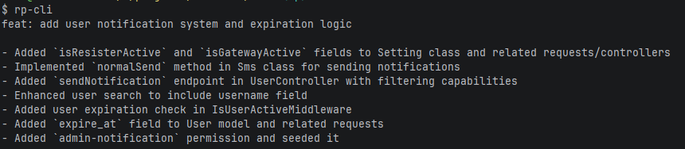

# RpCLI



A command-line interface tool that leverages AI to help with Git commit message generation.

## Prerequisites

- Node.js >=18.0.0
- Git installed and configured
- An active internet connection for AI API access

## Features

- Generate clear Git commit messages from staged changes using AI
- Multiple AI model support (GPT-4o Mini, DeepSeek V3.2, Qwen3 Coder Next, and more)
- Simple CLI interface

## Installation

### Via npm registry

```bash
npm install -g rp-cli
# or
pnpm install -g rp-cli
# or
bun install -g rp-cli
```

### Via source (without npm package)

```bash
git clone https://github.com/RezaParsian/RpCli.git
cd RpCli
npm install -g .
# or
pnpm install -g .
# or
bun install -g .
```

## Usage

```bash
# Generate a commit message from staged changes
rp-cli

# Show available AI models
rp-cli --models

# Use a specific model (1-6)
rp-cli --model 1

# Show version
rp-cli --version
```
### Available Models

| # | Model Name | Provider |
|---|------------|----------|
| 1 | GPT 4o mini | OpenAI |
| 2 | Step 3.5 Flash | OpenRouter |
| 3 | Gemma 4 31b it | OpenRouter |
| 4 | GPT OSS 120b | OpenRouter |
| 5 | DeepSeek V3.2 (default) | OpenRouter |
| 6 | Qwen3 Coder Next | OpenRouter |

## License

MIT © [RezaParsian](https://github.com/RezaParsian)